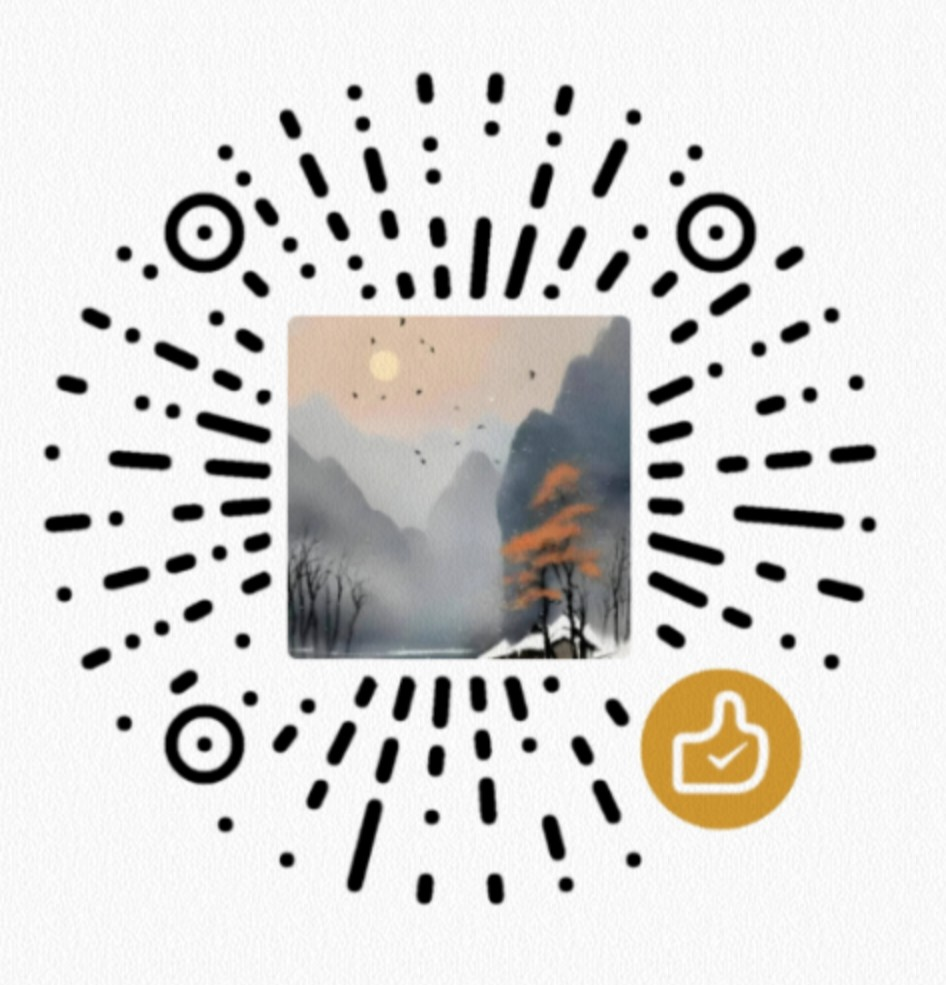

# moxsh Plugin Store

<p align="center">
  
  
  
  
</p>

<p align="center"><a href="README.md">中文</a> · <b>English</b></p>

> **Repo version: 1.0.0** · The index and catalog repo for official and community plugins. The moxsh App reads its catalog from here and installs `.mox` packages by `id`.

moxsh · a Linux terminal on your phone that feels as smooth as iOS.

<p align="center"></p>

<p align="center"><b>⭐ If this plugin store is useful to you, please give it a <a href="https://github.com/codecloud-dev/moxsh-plugins">Star</a> — it helps more developers discover the moxsh ecosystem!</b></p>


## 🐛 Welcome to roast me

> This is an early-stage project — **bugs exist, and probably plenty of them.** I'm not pretending it's perfect.
> Every pitfall you hit and every gripe you have is a chance to help make it better.

- 💥 Crashed / black screen / won't run? → [File a bug report](https://github.com/codecloud-dev/moxsh-plugins/issues)
- 💡 Want a feature? → [Open a feature request](https://github.com/codecloud-dev/moxsh-plugins/issues)
- 🗯️ Just want to rant or nitpick? → Issues are welcome too, label it whatever 😄

I read every issue and fix what I can, fast. Let's grow this from "runs" to "delightful" 💪

<p align="center">💛 Found it useful? <a href="https://afdian.com/a/cloudharbor">Buy the author a coffee on AfDian</a> — CN payments (WeChat / Alipay) supported, the biggest encouragement for an indie dev.</p>

<p align="center"></p>

---

<details>
<summary>📑 Contents</summary>

- [🗂️ Repo structure](#repo-structure)
- [🔧 How the App consumes this repo](#how-the-app-consumes-this-repo)
- [🔹 catalog.json fields](#catalogjson-fields)
- [📋 Full manifest `plugin.json` (authors must read)](#full-manifest-pluginjson-authors-must-read)
- [🛠️ Local validation (developers)](#local-validation-developers)
- [🧩 Submit your plugin](#submit-your-plugin)
- [🗺️ Roadmap](#roadmap)
- [🔹 Current status](#current-status)

</details>

## 🗂️ Repo structure

```text
moxsh-plugins/
├── catalog.json                    # Index consumed directly by the App (top-level object + entries array)
├── plugins.json                   # Community index with full metadata (repo / path / tags …)
├── schema/
│   └── catalog.schema.json         # JSON Schema (Draft 2020-12) for catalog.json, for author validation
├── plugins/
│   ├── hello-mox/
│   │   └── plugin.json           # One plugin's full manifest (plugin type)
│   └── glass-terminal-theme/
│       └── plugin.json            # One plugin's full manifest (theme type)
└── README.md
```

---

## 🔧 How the App consumes this repo

Behavior of `StoreRepository.CloudStoreApi` inside the moxsh App:

- Fetches `<base>/catalog.json`, expecting a **top-level object containing an `entries` array**;
- Every entry **must carry a `type`** — missing it makes `JSONObject.getString("type")` throw and the whole catalog fail to parse;
- Package download goes through `<base>/pkg/<id>.mox`.

So the public index is `catalog.json` + `entries`, not `plugins.json` + `plugins`. `plugins.json` is the full community/tooling index and now shares the `schemaVersion` key with `catalog.json` (since v1.0.0 the old `schema: 2` key is gone).

---

## 🔹 catalog.json fields

| Field | Required | Notes |
| --- | --- | --- |
| `id` | yes | Unique plugin id; alphanumerics plus `.` `_` `-`, not starting with `.` |
| `name` | yes | Display name |
| `version` | yes | Semver |
| `type` | **yes** | `plugin` / `skill` / `theme` / `rootfs`; missing it breaks App parsing |
| `author` | no | Author name |
| `description` | no | Long description, shown on the card |
| `minAppVersion` | no | Minimum moxsh version required |
| `permissions` | no | Permission list |
| `price` | no | Price; `0` means free |
| `purchased` | no | Purchased flag |
| `sizeBytes` | no | Package size, shown as "about x MB" (placeholder `0` until built) |
| `tags` | no | Tag array |
| `repository` | no | Source repo |
| `path` | no | Relative path of the manifest inside the repo |

---

## 📋 Full manifest `plugin.json` (authors must read)

Each plugin's `plugin.json` is its full manifest (compatibility matrix, distribution, entrypoints, capabilities, licensing, …). The fields follow a unified Schema (full 41-field spec: `moxsh-suite`'s `spec/plugin-manifest.schema.json`):

| Field | Type | Notes |
| --- | --- | --- |
| `schemaVersion` | string | Manifest Schema version, currently `"1.0"` |
| `id` / `name` / `version` | string | id / display name / semver |
| `author` | object | `{ "name": "...", "url": "..." }` |
| `description` | string | Description |
| `categories` / `tags` | array | Categories and tags |
| `visibility` | string | `open-source` / `closed-source` … |
| `license` | object | `{ "spdx": "GPL-3.0" }` |
| `pricing` | object | `{ "model": "free" \| "paid" \| "subscription" \| "system" }` |
| `compatibility` | object | `minAppVersion` / `minPluginApi` / `supportedOs` / `requiresRoot` / `requiresProot` |
| `distribution` | object | `type`(`git`/`file`) / `channel`(`stable`/`beta`) / `autoUpdate` |
| `entrypoints` | object | Lifecycle hooks, e.g. `{ "hooks": ["onEnable", "onApply"] }` |
| `permissions` | array | Permission declarations |
| `capabilities` | array | Capability declarations |
| `updatedAt` | string | ISO8601 update time |

See `plugins/hello-mox/plugin.json` and `plugins/glass-terminal-theme/plugin.json` for examples.

---

## 🛠️ Local validation (developers)

The repo ships `schema/catalog.schema.json`. Before submitting, validate `catalog.json` against it with any JSON Schema tool:

```bash
# Option 1: one-shot npx (no install)
npx --yes @hyperjump/json-schema-cli@latest validate \
  schema/catalog.schema.json catalog.json

# Option 2: ajv-cli
npm i -g ajv-cli
ajv compile -s schema/catalog.schema.json && ajv validate -s schema/catalog.schema.json -d catalog.json
```

> Note: the Schema only validates **structure** (field types / `type` enum / `id` format). Semantic correctness (e.g. whether `path` really exists, whether `minAppVersion` is sensible) still needs human/CI review.

---

## 🧩 Submit your plugin

1. Fork this repo, drop a `plugin.json` under `plugins/<plugin id>/`;
2. Append one entry to `plugins.json`'s `plugins` array (with `repo` / `path` / `tags`);
3. **Also append one entry to `catalog.json`'s `entries`** — the App only reads this file, and it must carry `type`;
4. Validate `catalog.json` with the Schema above;
5. Open a Pull Request; it goes live after review.

> Plugins must be open-source and free of malicious behavior; publishing implies consent to redistribute under the repo license.

---

## 🗺️ Roadmap

| Module | Status | Notes |
|------|------|------|
| Plugin index `catalog.json` | ✅ released | Consumed by the App since 0.x |
| Community index `plugins.json` | ✅ **unified at 1.0.0** | old `schema: 2` key unified to `schemaVersion` |
| Sample plugin `hello-mox` | ✅ released | `plugin` type |
| Sample theme `glass-terminal-theme` | ✅ **new in 1.0.0** | `theme` type, demonstrates multi-type support |
| `catalog.json` JSON Schema | ✅ **new in 1.0.0** | `schema/catalog.schema.json`, for author validation |
| Detailed author guide + field reference | ✅ **new in 1.0.0** | this README |
| `.mox` packaging in CI | ⏳ planned | `sizeBytes` still `0` placeholder; "package source not configured" is expected |
| Paid / subscription / system-builtin samples | ⏳ planned | spec already supports (`pricing` / `visibility`), samples pending |

---

## 🔹 Current status

The `.mox` packaging flow is not yet wired into CI, so `sizeBytes` in `catalog.json` is a `0` placeholder; when the package isn't ready, tapping install shows "package source not configured" — expected behavior.

---

moxsh · a Linux terminal on your phone that feels as smooth as iOS.
