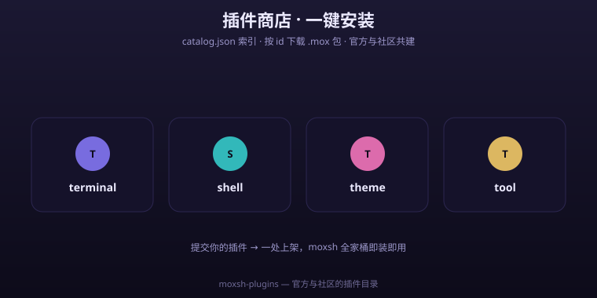

# moxsh 插件商店

<p align="center">
  
  
  
  
</p>


<p align="center"><a href="README.md">中文</a> · <a href="README.en.md">English</a></p>

> **仓库版本：1.0.0** · 官方与社区插件的索引与清单仓库。moxsh App 的插件商店从这里读取目录，按 id 下载 `.mox` 包安装。

moxsh · 让手机上的 Linux 像 iOS 一样顺滑。

<p align="center"></p>

<p><b>⭐ 如果这个插件商店对你有用,欢迎点个 <a href="https://github.com/codecloud-dev/moxsh-plugins">Star</a> —— 它能让更多开发者发现 moxsh 生态!</b></p>

<p>💛 觉得好用？欢迎到 <a href="https://afdian.com/a/cloudharbor">爱发电</a> 请作者喝杯咖啡 —— 国内可直接微信 / 支付宝收款，是独立开发最大的鼓励。</p>

---

<details>
<summary>📑 目录 · Contents</summary>

- [🗂️ 仓库结构](#仓库结构)
- [🔧 App 如何消费本仓库](#app-如何消费本仓库)
- [🔹 catalog.json 字段](#catalogjson-字段)
- [📋 完整清单 `plugin.json`（作者必读）](#完整清单-pluginjson作者必读)
- [🛠️ 本地校验清单（开发者）](#本地校验清单开发者)
- [🧩 提交你的插件](#提交你的插件)
- [🗺️ 进度表 / 路线图](#进度表-路线图)
- [🔹 当前状态](#当前状态)

</details>

## 🗂️ 仓库结构

```text
moxsh-plugins/
├── catalog.json                    # App 直接消费的索引（顶层对象 + entries 数组）
├── plugins.json                    # 社区索引，含 repo / path / tags 等全量元数据
├── schema/
│   └── catalog.schema.json         # catalog.json 的 JSON Schema（Draft 2020-12），供作者校验
├── plugins/
│   ├── hello-mox/
│   │   └── plugin.json             # 单个插件的完整清单（plugin 类型）
│   └── glass-terminal-theme/
│       └── plugin.json             # 单个插件的完整清单（theme 类型）
└── README.md
```

---

## 🔧 App 如何消费本仓库

moxsh App 内 `StoreRepository.CloudStoreApi` 的行为：

- 拉取 `<base>/catalog.json`，要求**顶层是对象、内含 `entries` 数组**；
- 每条 entry **必须带 `type`**——缺失会导致 `JSONObject.getString("type")` 直接抛错、整个商店目录解析失败；
- 包下载走 `<base>/pkg/<id>.mox`。

因此对外提供索引时是 `catalog.json` + `entries`，而不是 `plugins.json` + `plugins`。`plugins.json` 是给社区/工具用的全量索引，现与 `catalog.json` 统一使用 `schemaVersion` 键（v1.0.0 起不再用旧 `schema: 2`）。

---

## 🔹 catalog.json 字段

| 字段 | 必需 | 说明 |
| --- | --- | --- |
| `id` | 是 | 插件唯一标识，仅字母数字与 `.` `_` `-`，不以 `.` 开头 |
| `name` | 是 | 展示名称 |
| `version` | 是 | 语义化版本号 |
| `type` | **是** | `plugin` / `skill` / `theme` / `rootfs`，缺此字段 App 会解析失败 |
| `author` | 否 | 作者名 |
| `description` | 否 | 详细说明，卡片展示 |
| `minAppVersion` | 否 | 要求的最低 moxsh 版本 |
| `permissions` | 否 | 权限列表 |
| `price` | 否 | 价格，`0` 为免费 |
| `purchased` | 否 | 已购标记 |
| `sizeBytes` | 否 | 包体积，卡片显示"约 x MB"（包体未就绪时为 `0` 占位） |
| `tags` | 否 | 标签数组 |
| `repository` | 否 | 源码仓库 |
| `path` | 否 | 插件清单在仓库内的相对路径 |

---

## 📋 完整清单 `plugin.json`（作者必读）

每个插件目录下的 `plugin.json` 是插件的完整清单（含兼容矩阵、分发方式、入口点、能力、授权等）。
以下字段遵循统一 Schema（完整 41 字段规范见 `moxsh-suite` 的 `spec/plugin-manifest.schema.json`）：

| 字段 | 类型 | 说明 |
| --- | --- | --- |
| `schemaVersion` | string | 清单 Schema 版本，当前 `"1.0"` |
| `id` / `name` / `version` | string | 标识 / 展示名 / 语义化版本 |
| `author` | object | `{ "name": "...", "url": "..." }` |
| `description` | string | 说明 |
| `categories` / `tags` | array | 分类与标签 |
| `visibility` | string | `open-source` / `closed-source` 等 |
| `license` | object | `{ "spdx": "GPL-3.0" }` |
| `pricing` | object | `{ "model": "free" \| "paid" \| "subscription" \| "system" }` |
| `compatibility` | object | `minAppVersion` / `minPluginApi` / `supportedOs` / `requiresRoot` / `requiresProot` |
| `distribution` | object | `type`(`git`/`file`) / `channel`(`stable`/`beta`) / `autoUpdate` |
| `entrypoints` | object | 生命周期钩子，如 `{ "hooks": ["onEnable", "onApply"] }` |
| `permissions` | array | 权限声明 |
| `capabilities` | array | 能力声明 |
| `updatedAt` | string | ISO8601 更新时间 |

示例见 `plugins/hello-mox/plugin.json` 与 `plugins/glass-terminal-theme/plugin.json`。

---

## 🛠️ 本地校验清单（开发者）

仓库附带 `schema/catalog.schema.json`。提交前可用任意 JSON Schema 工具校验 `catalog.json` 是否符合结构：

```bash
# 方式一：npx 一次性校验（无需安装）
npx --yes @hyperjump/json-schema-cli@latest validate \
  schema/catalog.schema.json catalog.json

# 方式二：ajv-cli
npm i -g ajv-cli
ajv compile -s schema/catalog.schema.json && ajv validate -s schema/catalog.schema.json -d catalog.json
```

> 注意：Schema 只校验**结构**（字段类型 / `type` 枚举 / `id` 格式）。语义正确性（如 `path` 是否真实存在、`minAppVersion` 是否合理）仍需人工/CI 复核。

---

## 🧩 提交你的插件

1. Fork 本仓库，在 `plugins/<插件 id>/` 下放 `plugin.json`；
2. 往 `plugins.json` 的 `plugins` 数组追加一条（含 `repo` / `path` / `tags`）；
3. **同步往 `catalog.json` 的 `entries` 追加一条**——App 只读这个文件，务必带 `type`；
4. 用上面的 Schema 校验 `catalog.json`；
5. 发起 Pull Request，审核通过后即上架。

> 插件须为开源、无恶意行为；上架即视为同意以仓库许可证分发。

---

## 🗺️ 进度表 / 路线图

| 模块 | 状态 | 说明 |
|------|------|------|
| 插件索引 `catalog.json` | ✅ 已发布 | 0.x 起，App 直接消费 |
| 社区索引 `plugins.json` | ✅ **1.0.0 统一** | 旧 `schema: 2` 键名已统一为 `schemaVersion` |
| 示例插件 `hello-mox` | ✅ 已发布 | `plugin` 类型 |
| 示例主题 `glass-terminal-theme` | ✅ **1.0.0 新增** | `theme` 类型，演示多类型支持 |
| `catalog.json` JSON Schema | ✅ **1.0.0 新增** | `schema/catalog.schema.json`，供作者校验 |
| 详细作者指南 + 字段参考 | ✅ **1.0.0 新增** | 本 README |
| `.mox` 打包接入 CI | ⏳ 待规划 | `sizeBytes` 仍为 `0` 占位，安装提示"包源未配置"属预期 |
| 付费 / 订阅 / 系统内置示例 | ⏳ 规划中 | 规范已支持（`pricing` / `visibility`），待补示例 |

---

## 🔹 当前状态

`.mox` 打包流程尚未接入 CI，`catalog.json` 里的 `sizeBytes` 暂为 `0` 占位；
包体未就绪时，App 点安装会提示"包源未配置"，属预期表现。

---

moxsh · 让手机上的 Linux 像 iOS 一样顺滑。
